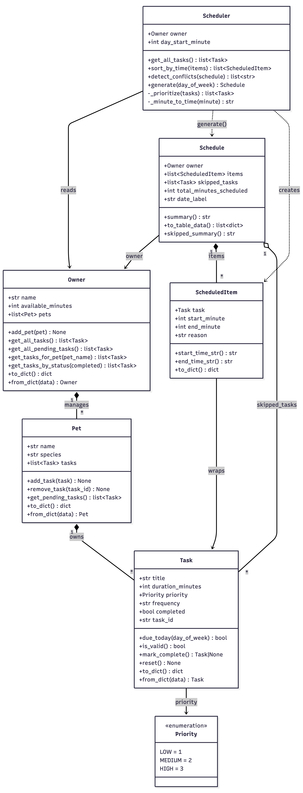

# PawPal+ Project Reflection

## 1. System Design

**a. Initial design**

The three core actions a user should be able to perform in PawPal+:

1. **Set up owner and pet info** — The user enters basic details about themselves (name, available time per day) and their pet (name, species, age). This establishes the context the scheduler uses to filter and prioritize tasks.

2. **Add and edit care tasks** — The user creates tasks (e.g., walk, feeding, medication, grooming) with at minimum a duration and a priority level. Tasks can be updated or removed as the pet's needs change.

3. **Generate and view the daily plan** — The user requests a daily schedule. The app produces an ordered plan that fits within the owner's available time, respects task priorities, and displays an explanation of why tasks were chosen or deferred.

**Main objects in the system:**

The system is organized into seven classes across three layers.

**`Priority` (Enum)**
- Holds: `LOW = 1`, `MEDIUM = 2`, `HIGH = 3`
- Actions: provides integer values that allow the Planner to sort tasks by urgency without extra mapping

**`Owner`**
- Holds: `name` (str), `available_minutes` (int, default 120) — the primary capacity constraint
- Actions: `to_dict()` to serialize for session state; `from_dict()` to reconstruct

**`Pet`**
- Holds: `name` (str), `species` (str — "dog", "cat", or "other")
- Actions: `to_dict()` / `from_dict()` for session state

**`Task`**
- Holds: `title` (str), `duration_minutes` (int ≥ 1), `priority` (Priority), `task_id` (auto-generated UUID)
- Actions: `is_valid()` to check inputs before adding; `to_dict()` / `from_dict()` for session state

**`ScheduledItem`**
- Holds: `task` (Task reference), `start_minute` (int), `end_minute` (int, computed), `reason` (str explanation)
- Actions: `start_time_str()` and `end_time_str()` to convert minutes to readable times; `to_dict()` for display table

**`Schedule`**
- Holds: `owner`, `pet`, `items` (list of ScheduledItems ordered by start time), `skipped_tasks` (list of Tasks that didn't fit), `total_minutes_scheduled`, `date_label`
- Actions: `summary()` returns a text explanation of the plan; `to_table_data()` returns a list of dicts for `st.table()`; `skipped_summary()` explains what was left out

**`Planner`**
- Holds: `owner`, `pet`, `tasks` (candidate pool), `day_start_minute` (default 480 = 8:00 AM)
- Actions: `set_tasks()` to update the task pool; `_sort_tasks()` (private) sorts by priority then duration; `generate()` runs a greedy algorithm — fits tasks in priority order until time runs out, returns a Schedule

**Class diagram (final — updated to match implemented code):**

**Changes from initial design:**
- `Pet` now owns `tasks` directly (list attribute) — initial design had tasks as a separate concern
- `Owner` gained `get_tasks_for_pet()` and `get_tasks_by_status()` filter methods
- `Task` gained `frequency`, `completed`, `due_today()`, and `mark_complete()` returning `Task|None` for recurrence
- `Scheduler` replaced `Planner` and gained `sort_by_time()` and `detect_conflicts()`
- `Schedule` no longer holds a `Pet` reference — it references `Owner` (which already contains pets)

**b. Design changes**

Yes, the design changed significantly during implementation. The most important change was renaming `Planner` to `Scheduler` and expanding its responsibilities. In the initial UML, `Planner` was a thin wrapper that only called `generate()`. During implementation it became clear that the scheduler also needed to own filtering (`get_all_tasks()`), sorting (`sort_by_time()`), and conflict detection (`detect_conflicts()`), so it grew into the true "brain" of the system.

A second change was moving `tasks` from a separate concern into `Pet` as a direct list attribute. The initial design treated tasks as loosely associated data; once `Pet.add_task()` and `Pet.get_pending_tasks()` were implemented, it became obvious that a pet owns its tasks the same way an owner owns their pets — a composition relationship, not just a reference.

A third change was dropping the `pet` reference from `Schedule`. The initial design passed both `Owner` and `Pet` to `Schedule`, but since `Owner` already contains all pets, passing `Pet` separately was redundant and made the API harder to use for multi-pet schedules.

---

## 2. Scheduling Logic and Tradeoffs

**a. Constraints and priorities**

The scheduler considers three constraints:

1. **Available time** (`Owner.available_minutes`) — the hard cap. No task is scheduled if it would push total time over this limit. This was treated as the most important constraint because a pet owner with 60 minutes truly cannot do 120 minutes of tasks; exceeding this silently would make the app useless.

2. **Task priority** (`Priority.HIGH/MEDIUM/LOW`) — the ordering rule. High-priority tasks (medication, feeding) are always placed before lower-priority ones so that if time runs out, the least important items are the ones skipped.

3. **Frequency / due date** (`Task.frequency` + `due_today()`) — a filter constraint. Weekly tasks only appear on Mondays. This prevents the schedule from being cluttered with tasks that are not actually due today.

Available time was made primary because it is a real-world hard limit. Priority was made secondary because the whole value of a scheduler over a plain list is that it handles urgency automatically. Frequency was added last because it only matters for recurring tasks and does not affect the core greedy algorithm.

**b. Tradeoffs**

The scheduler uses a **greedy, duration-based overlap check** rather than exact time-slot matching.

When building the schedule it walks tasks in priority order and places each one immediately after the previous, tracking a running `current_minute` clock. A task is accepted if `task.duration_minutes <= remaining` — there is no check for whether a specific clock time is already occupied by another task. Conflict detection is a separate, after-the-fact scan (`detect_conflicts`) rather than a guard during placement.

**Why this tradeoff is reasonable:** For a daily pet care routine the owner is not blocking out calendar slots — they just want the highest-priority work done first within their available window. A greedy fit is simple to reason about, easy to test, and produces no overlaps by construction (tasks are placed back-to-back). The separate conflict detector exists as a safety net for cases where manual start times are introduced later, without complicating the core scheduling path. The cost is that the scheduler cannot pack tasks into gaps created by already-completed items; it always appends to the end of the current time block. This is an acceptable tradeoff for a single-owner, single-day planner.

---

## 3. AI Collaboration

**a. How you used AI**

AI was used in four distinct ways throughout this project:

- **Design brainstorming** — asking "what classes does a pet care scheduler need?" before writing any code. This surfaced the `ScheduledItem` wrapper class, which I had not thought of on my own. Having a dedicated object for a task-placed-in-time (vs. a task in the pool) made the display logic much cleaner.
- **Skeleton generation** — converting the UML into Python dataclass stubs. The AI produced correct `field(default_factory=...)` patterns for mutable defaults and `ClassVar` annotations for class-level constants, both of which are easy to get wrong by hand.
- **Algorithm comparison** — asking "should I sort by string 'HH:MM' or by integer `start_minute`?" The AI explained that integer comparison is O(1) per comparison with no parsing overhead, which confirmed the right choice.
- **Debugging** — when the `_FREQUENCY_DAYS` dict on the `Task` dataclass raised a `ValueError` about mutable defaults, the AI identified the fix (`ClassVar[dict]`) immediately.

The most helpful prompt pattern was asking a narrow, specific question with context: "Given this dataclass, why does Python raise this error?" produced a precise fix. Broad prompts like "make this better" were less useful.

**b. Judgment and verification**

When the AI first proposed the `Planner` class, it included a `set_tasks()` method that replaced the entire task list. I questioned whether that was necessary — the UI rebuilds the scheduler on every button click anyway, so the method would never actually be called. I kept it in the stub phase but verified by tracing through the Streamlit execution model: since Streamlit reruns the script top-to-bottom on each interaction, a new `Scheduler` is constructed each time `generate()` is called. `set_tasks()` would only matter if the Scheduler were stored in session state across reruns. I left it in for completeness but did not rely on it anywhere in `app.py`, which confirmed the AI's suggestion was architecturally sound but practically unnecessary for this implementation.

---

## 4. Testing and Verification

**a. What you tested**

Ten behaviors were tested across three categories:

- **Task state** — `mark_complete()` flips `completed` to `True`; `add_task()` grows the pet's task list. These are the most fundamental operations; if they break, nothing else works.
- **Sorting correctness** — `sort_by_time()` returns items in ascending `start_minute` order and does not mutate the original list. Important because the UI displays items in this order; a silent mutation would scramble the schedule on the next render.
- **Recurrence logic** — daily and weekly tasks return a fresh incomplete `Task` from `mark_complete()`; `as_needed` tasks return `None`. Important because incorrect recurrence either floods the task list (if every task recurs) or silently drops future occurrences (if recurring tasks return `None`).
- **Conflict detection** — partial overlaps, exact-same-start, and back-to-back (non-conflicting) cases. The non-conflicting case is as important as the conflicting ones: a false positive on sequential tasks would make the app report "conflict" after every normal schedule generation.

**b. Confidence**

**4 / 5.** The behaviors most likely to have subtle bugs — conflict boundary conditions, recurrence type-checking, sort stability — are all explicitly covered and passing. Confidence is not 5/5 because three scenarios remain untested: (1) the capacity limit path where `generate()` skips tasks because available time runs out, (2) `due_today()` with each day-of-week value for weekly tasks, and (3) the full end-to-end `generate()` integration with a real Owner/Pet/Scheduler stack. These would be the next tests to write — particularly the capacity test, since that is the core value proposition of the scheduler.

---

## 5. Reflection

**a. What went well**

The separation of concerns between data (`Task`, `Pet`, `Owner`), scheduling output (`ScheduledItem`, `Schedule`), and logic (`Scheduler`) worked cleanly in practice. Each class had one clear job, which made it easy to add features — recurrence logic went entirely into `Task.mark_complete()`, conflict detection went entirely into `Scheduler.detect_conflicts()`, and neither change touched any other class. The `to_dict()` / `from_dict()` pattern on every data class also made the Streamlit session state integration straightforward with no special serialization code in `app.py`.

**b. What you would improve**

The frequency system is too rigid. "Weekly" tasks are hardcoded to Monday only — a real pet owner might want their groomer to come every Saturday, not every Monday. A better design would store a specific weekday number (0–6) on the task rather than the string `"weekly"`, and `due_today()` would compare against that number. I would also persist the owner and task data to a file (JSON) between app sessions, since right now all data is lost on page refresh.

**c. Key takeaway**

Designing the system on paper before writing code forced decisions that were much harder to change later — particularly which object owns which data. Moving `tasks` into `Pet` as a composition relationship (rather than a loose association) was a design choice that rippled through every method that filters or retrieves tasks. The lesson is that ownership relationships in a class diagram are not cosmetic: they determine which methods go where, and changing them mid-build is expensive. Getting that right in the UML phase, even imperfectly, saved significant refactoring time.
