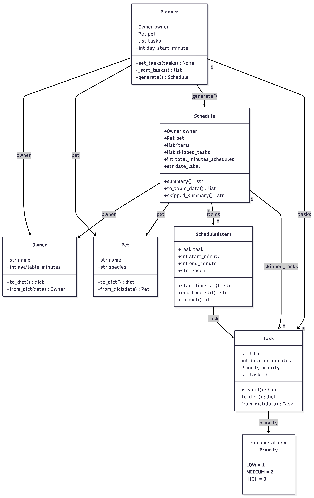

# PawPal+ Project Reflection

## 1. System Design

**a. Initial design**

The three core actions a user should be able to perform in PawPal+:

1. **Set up owner and pet info** — The user enters basic details about themselves (name, available time per day) and their pet (name, species, age). This establishes the context the scheduler uses to filter and prioritize tasks.

2. **Add and edit care tasks** — The user creates tasks (e.g., walk, feeding, medication, grooming) with at minimum a duration and a priority level. Tasks can be updated or removed as the pet's needs change.

3. **Generate and view the daily plan** — The user requests a daily schedule. The app produces an ordered plan that fits within the owner's available time, respects task priorities, and displays an explanation of why tasks were chosen or deferred.

**Main objects in the system:**

The system is organized into seven classes across three layers.

**`Priority` (Enum)**
- Holds: `LOW = 1`, `MEDIUM = 2`, `HIGH = 3`
- Actions: provides integer values that allow the Planner to sort tasks by urgency without extra mapping

**`Owner`**
- Holds: `name` (str), `available_minutes` (int, default 120) — the primary capacity constraint
- Actions: `to_dict()` to serialize for session state; `from_dict()` to reconstruct

**`Pet`**
- Holds: `name` (str), `species` (str — "dog", "cat", or "other")
- Actions: `to_dict()` / `from_dict()` for session state

**`Task`**
- Holds: `title` (str), `duration_minutes` (int ≥ 1), `priority` (Priority), `task_id` (auto-generated UUID)
- Actions: `is_valid()` to check inputs before adding; `to_dict()` / `from_dict()` for session state

**`ScheduledItem`**
- Holds: `task` (Task reference), `start_minute` (int), `end_minute` (int, computed), `reason` (str explanation)
- Actions: `start_time_str()` and `end_time_str()` to convert minutes to readable times; `to_dict()` for display table

**`Schedule`**
- Holds: `owner`, `pet`, `items` (list of ScheduledItems ordered by start time), `skipped_tasks` (list of Tasks that didn't fit), `total_minutes_scheduled`, `date_label`
- Actions: `summary()` returns a text explanation of the plan; `to_table_data()` returns a list of dicts for `st.table()`; `skipped_summary()` explains what was left out

**`Planner`**
- Holds: `owner`, `pet`, `tasks` (candidate pool), `day_start_minute` (default 480 = 8:00 AM)
- Actions: `set_tasks()` to update the task pool; `_sort_tasks()` (private) sorts by priority then duration; `generate()` runs a greedy algorithm — fits tasks in priority order until time runs out, returns a Schedule

**Class diagram:**

**b. Design changes**

- Did your design change during implementation?
- If yes, describe at least one change and why you made it.

---

## 2. Scheduling Logic and Tradeoffs

**a. Constraints and priorities**

- What constraints does your scheduler consider (for example: time, priority, preferences)?
- How did you decide which constraints mattered most?

**b. Tradeoffs**

- Describe one tradeoff your scheduler makes.
- Why is that tradeoff reasonable for this scenario?

---

## 3. AI Collaboration

**a. How you used AI**

- How did you use AI tools during this project (for example: design brainstorming, debugging, refactoring)?
- What kinds of prompts or questions were most helpful?

**b. Judgment and verification**

- Describe one moment where you did not accept an AI suggestion as-is.
- How did you evaluate or verify what the AI suggested?

---

## 4. Testing and Verification

**a. What you tested**

- What behaviors did you test?
- Why were these tests important?

**b. Confidence**

- How confident are you that your scheduler works correctly?
- What edge cases would you test next if you had more time?

---

## 5. Reflection

**a. What went well**

- What part of this project are you most satisfied with?

**b. What you would improve**

- If you had another iteration, what would you improve or redesign?

**c. Key takeaway**

- What is one important thing you learned about designing systems or working with AI on this project?
